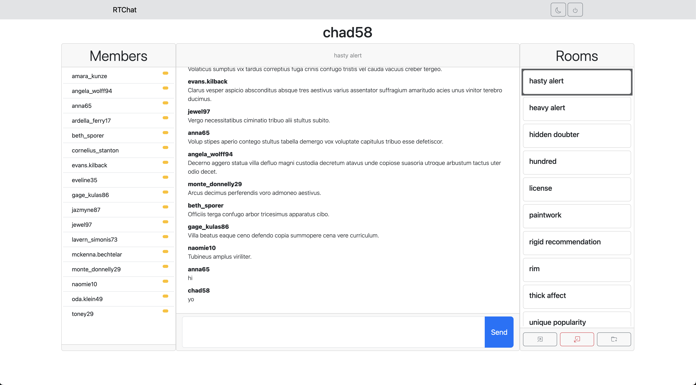
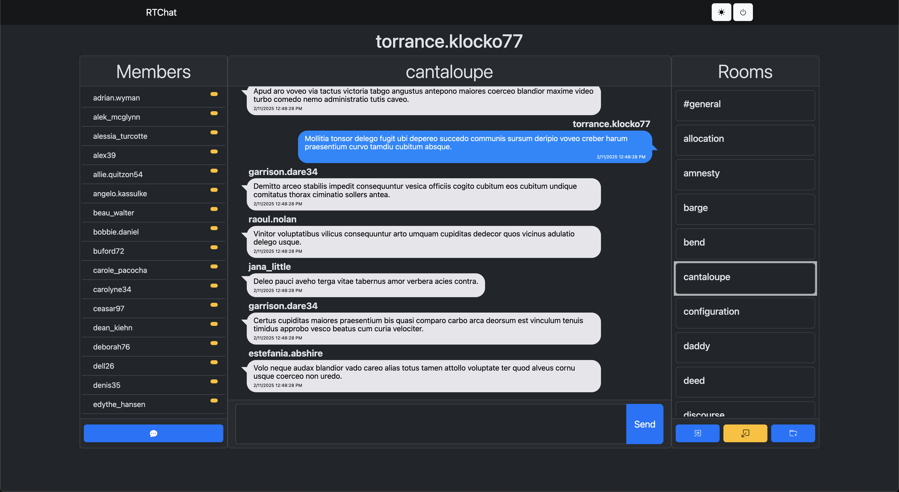
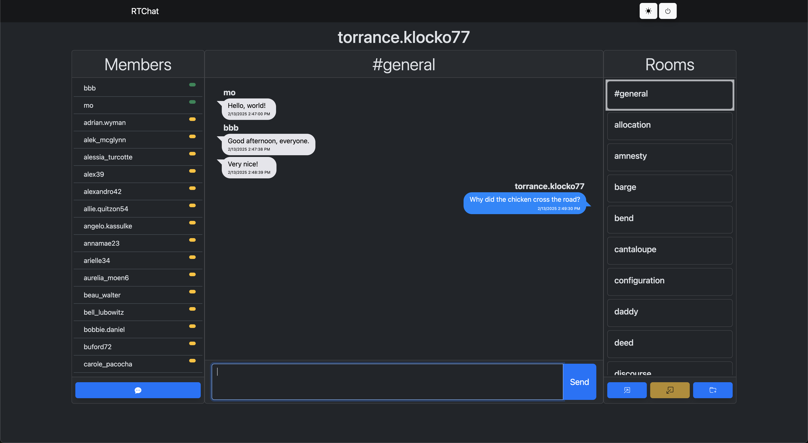
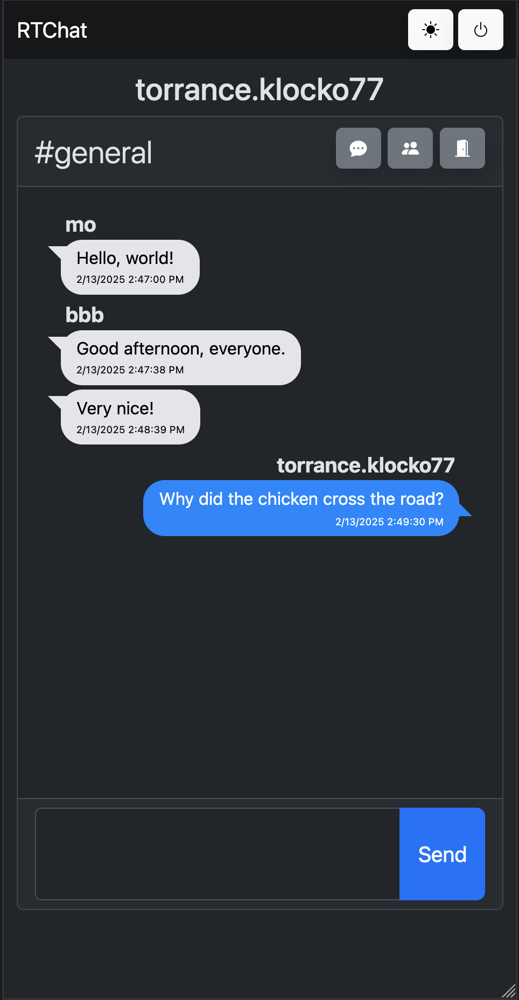
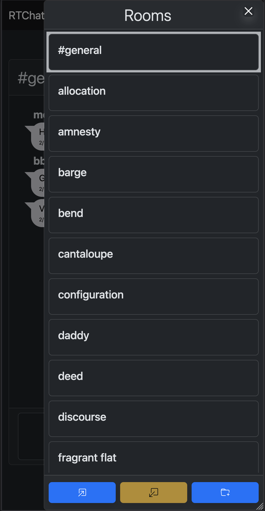
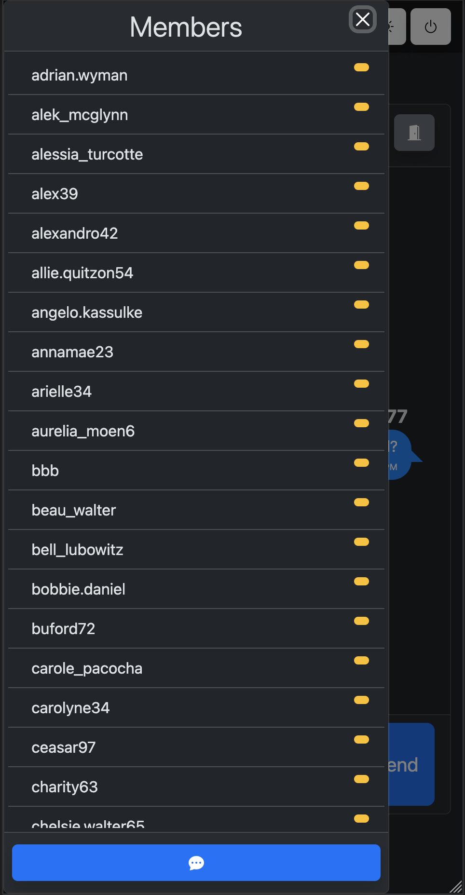

# RTChat

A real-time chat app with support for multiple rooms, direct messaging, and dark mode

## [Start chatting now! (beta)](https://rtchat-a7ul.onrender.com)

### Features:
 - Session Based Authentication & Authorization [*](#user-content-jwt)
 - WebSocket Authentication
 - Dark Mode
 - Responsive
 - Abstract database access level
   - This means we can use nearly any medium for storage, even an API!
 - We have custom wrappers around WebSockets!
   - [WebSocketeer](client/src/ws/WebSocketeer.ts) for client side
   - [WebSocketApp](server/wss/WebSocketApp.ts) for server side
   - Makes writing WebSocket code feel like you're writing Express routes
   - Each "route" is a message type, which makes sending and/or parsing messages a breeze!

### Technologies Used

#### Backend
 - [Express](https://expressjs.com/)
 - [TypeScript](https://www.typescriptlang.org/)
 - [WebSockets](https://en.wikipedia.org/wiki/WebSocket) (specifically [ws](https://github.com/websockets/ws))
 - [SQLite3](https://www.sqlite.org/) (mostly)

#### Frontend
 - [ReactJS](http://react.dev/)
 - [Bootstrap 5](https://getbootstrap.com/)

<a name="jwt">*</a>Pseudo-sessions via JWT. I was testing various auth strategies, got sick of testing different strats, and settled with using a JWT as a session-like token. I plan on migrating to full on sessions soon.

---

# Look & Feel

****Subject to change, may look different now***

## Default Look

## Dark mode!

## Live Member Status

See whos online _right now_

## Responsive

Optimized for all devices!

---

---

##### Older Versions

[Version 1](https://chat-app-ghpq.onrender.com)
