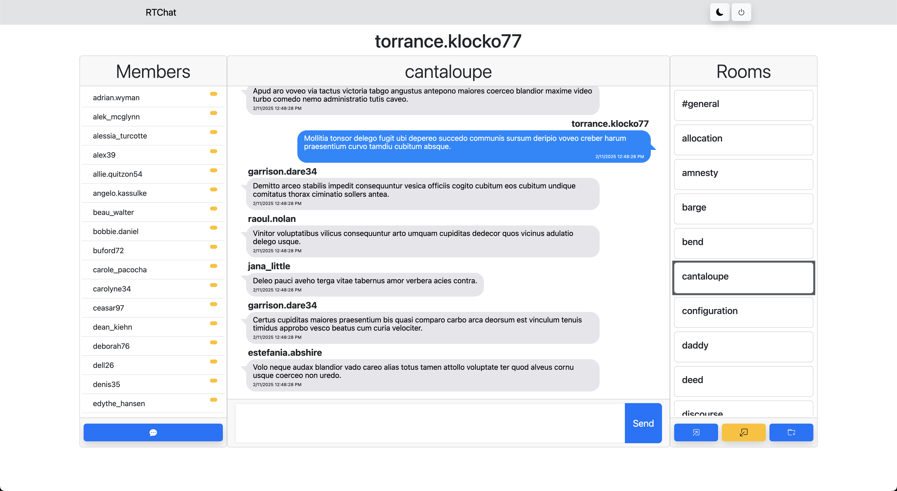

  <h1>RTChat</h1>
  <heading>A full-stack real-time chat app with support for multiple rooms, direct messaging, and dark mode</heading>

    <h4><a href="https://rtchat-a7ul.onrender.com">Start Chatting Now!</a></h4>

 

	    
  
  
  
  
  
  
   
  

 

# Features:

- Session Based Authentication & Authorization [\*](#user-content-jwt)
- WebSocket Authentication
- Dark Mode
- Responsive
- Abstract database access level
  - This means we can use nearly any medium for storage, even an API!
- We have custom wrappers around WebSockets!
  - [WebSocketeer](client/src/ws/WebSocketeer.ts) for client side
  - [WebSocketApp](server/wss/WebSocketApp.ts) for server side
  - Makes writing WebSocket code feel like you're writing Express routes
  - Each "route" is a message type, which makes sending and/or parsing messages a breeze!

# Look & Feel

\***_Subject to change, may look different now_**

## Default Look

## Dark mode!

## Live Member Status

See whos online _right now_

## Responsive

Optimized for all devices!

---

---

---

<a name="jwt">\*</a>Pseudo-sessions via JWT. I was testing various auth strategies, got sick of testing different strats, and settled with using a JWT as a session-like token. I plan on migrating to full on sessions soon.

---

##### Older Versions

[Version 1](https://chat-app-ghpq.onrender.com)
